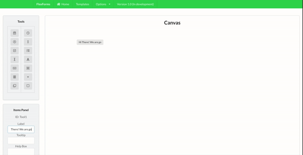
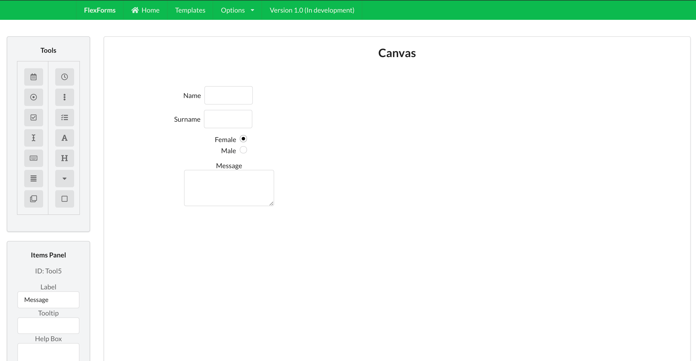

<h1>FlexForms</h1>

> Flexforms is a flexible form builder which can be used to build any form of your choice in any way you like.

> Whether its to setup a guest list or to send out birthday/wedding invites and view the data collected, FlexForms has got you covered!

<a href="https://paulologeh.github.io/FlexForms/">Click here to Visit Application</a>

## Table of Contents

- [Setup](#setup)
- [Features](#features)
- [Tutorial](#tutorial)
- [Documentation](#documentation)
- [FAQ](#faq)
- [Support](#support)
- [License](#license)

## Example App

## Setup
No need to sign up!
No user data collection!
We only accept crypto for advanced features

## Features

### Tools
FlexForms has a collection of tools that you can use as building blocks on the forms.

### Canvas
This is the area where you put together the elements of your form.

### Items Panel
This is used to edit individual tools.

## Tutorial
<a href="https://drive.google.com/file/d/1sGTRyLgMSAZS2wvASxWgZBG9mJWOsGRS/preview">Click to watch Tutorial video</a>
<!-- 
use camo.github https://gist.github.com/fvcproductions/1bfc2d4aecb01a834b46
 -->

## Documentation
** coming soon **

## FAQ
** coming soon **

## Support
** coming soon **
